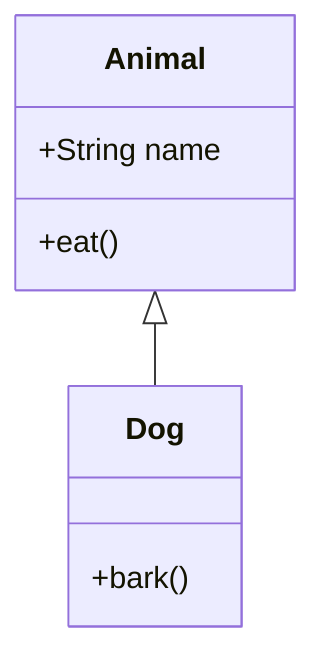
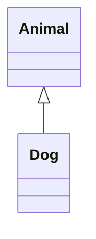
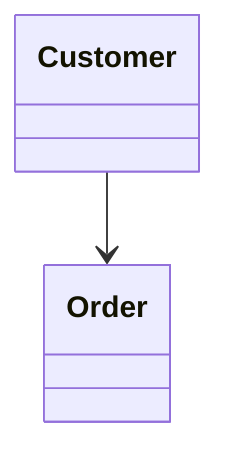
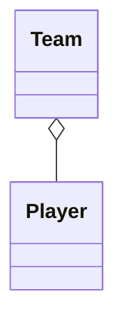
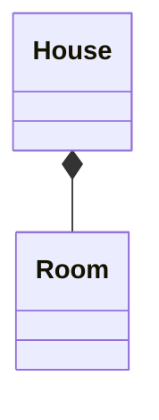
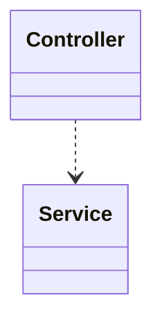
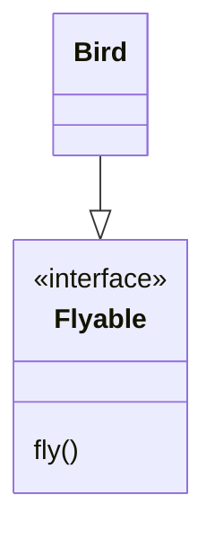
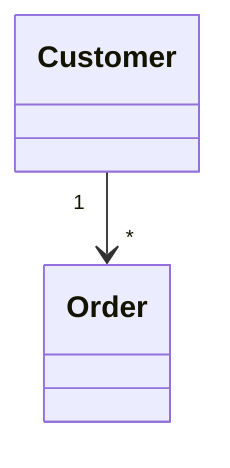
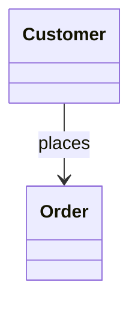
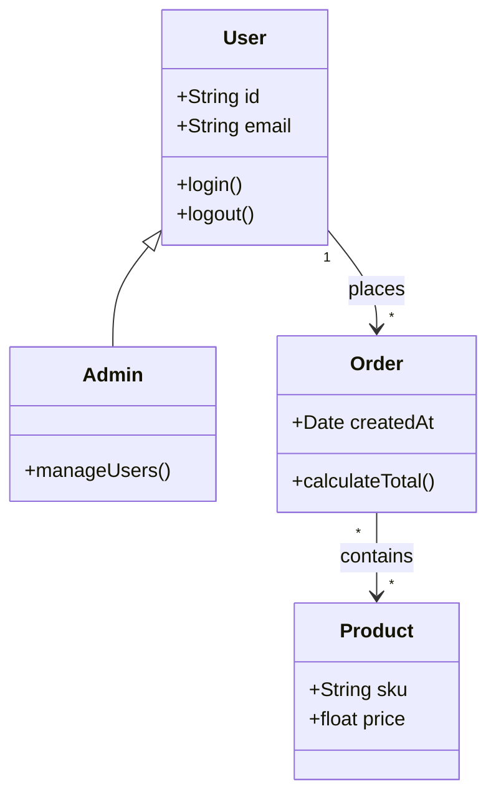

A Mermaid class diagram is a way to describe object-oriented structures (classes, attributes, methods, inheritance, relationships) using simple text syntax that renders into UML-style diagrams.

## Basic Example

This creates:

* `Animal` class with fields and methods
* `Dog` class inheriting from `Animal`

---

# Common Syntax

### Visibility Symbols

| Symbol | Meaning          |
| ------ | ---------------- |
| `+`    | public           |
| `-`    | private          |
| `#`    | protected        |
| `~`    | package/internal |

---

# Relationships

## Inheritance

## Association

## Aggregation

## Composition

## Dependency

---

# Interfaces

---

# Multiplicity

Examples:

* `"1"` = exactly one
* `"*"` = many
* `"0..1"` = optional
* `"1..*"` = one or more

---

# Labels

---

# Full Example

